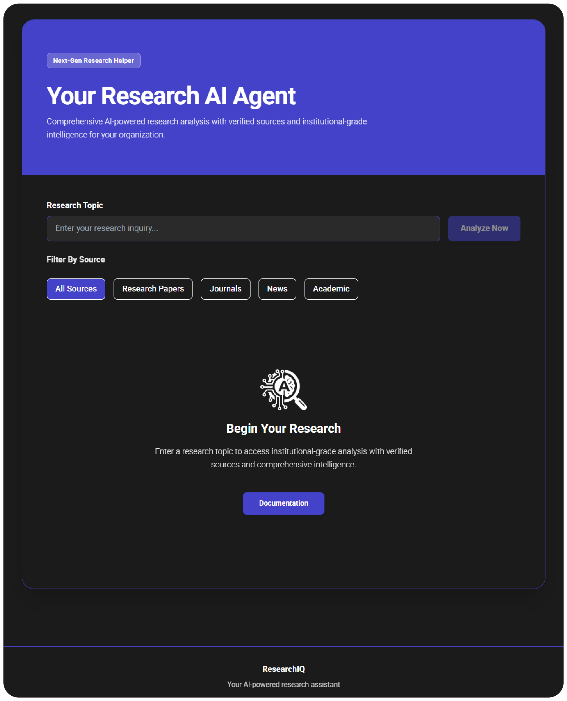

# ResearchIQ

**Enterprise-Grade Research Intelligence Platform**

An enterprise-class research analysis system integrating advanced AI capabilities via Perplexity AI's API infrastructure with industry-standard architecture patterns for institutional deployments.

## Core Architecture

- **AI-Driven Analysis Engine** - Advanced NLP and semantic analysis delivering comprehensive research evaluation with multi-dimensional topic exploration
- **Multi-Source Data Integration** - Aggregates academic literature, institutional repositories, scholarly journals, and news intelligence with configurable source prioritization
- **Real-Time Progressive Pipeline** - Event-driven architecture with asynchronous processing and continuous feedback mechanisms for real-time result streaming
- **Responsive Enterprise UI** - Tailwind CSS-based design with accessibility compliance and professional information architecture
- **Secure API Infrastructure** - RESTful API with authentication/authorization, encrypted credential management, and comprehensive audit logging
- **Cross-Platform Compatibility** - Seamless deployment across desktop, mobile, and responsive web contexts

## Interface Preview

  
   
  

---

**Enterprise Research Intelligence Platform | 2026**
